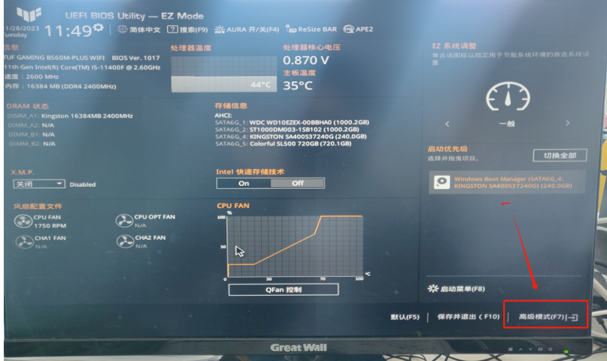
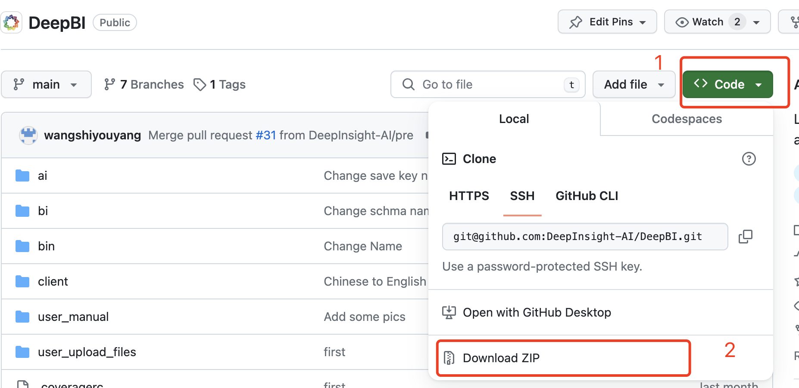

### Docker安装说明pdf 下载

- [PDF 中文Docker安装下载](./user_manual/中文docker安装说明.pdf)

# Windows
- windows 11 可以直接安装
- 注意 Windows 10 需要更新到 22H2版本及以上命令行运行<br>
  打开文件夹，在文件夹地址栏输入 ```cmd```按回车(ERTER)，然后命令行输入 ``` winver ```按回车(ENTER) 查看版本号

## 安装docker
1. 需要调整本地主板虚拟化选项<br>
  首先重启电脑，重启电脑时不断按“F1”和“F2”和“DEL”这三个键进入Bios（因为大部分主板是这三个按键的其中一个，所以一起按，另外注意笔记本是按“ESC”键）<br>
  
  
  


2. 你可以通过 https://learn.microsoft.com/en-us/windows/wsl/install 或者在微软商店进行安装 WSL
  或者通过管理员命令行安装如下图：
  

- 进入到命令符窗口运行下面的命令
```
  WSL --install
```


- 如果出现，下面的提示<br>
 

- 解决方案
```
 运行: wsl --list --online 查看可以安装的版本
 然后运行: wsl --install -d Ubuntu-20.04 # 这里的Ubuntu-20.04 就是版本号
```

4. 打开管理员命令行，登录 WSL
5. 运行命令```wsl```或者 ```wsl -u [username]``` username 是你之前安装的用户名
6. 登录后，我们开始安装 docker（每行为一个命令依次运行，下同）

```
   sudo apt update
   sudo apt install apt-transport-https ca-certificates curl software-properties-common
   curl -fsSL https://download.docker.com/linux/ubuntu/gpg | sudo apt-key add -
   sudo add-apt-repository "deb [arch=amd64] https://download.docker.com/linux/ubuntu $(lsb_release -cs) stable"
   sudo apt update
   sudo apt install docker-ce
   sudo service docker start
   sudo service docker status
```
6. 安装完毕docker，将权限给当前登录用户
```sudo usermod -aG docker $USER```
7. 启动 docker 命令```sudo service docker start```
8. 检查docker 运行状态 ```service docker status``` 为 "active (running)" 或者 "Docker is running" 则为正常
9. 如果遇到```Docker is not running```
- 解决方案，运行下命令
```
sudo update-alternatives --set iptables /usr/sbin/iptables-legacy
sudo update-alternatives --set ip6tables /usr/sbin/ip6tables-legacy
```
10. 安装 docker-compose
```
sudo apt-get install docker-compose
sudo rm /usr/local/bin/docker-compose
sudo ln -s /usr/bin/docker-compose /usr/local/bin/docker-compose
```
11. 安装网络管理 命令: ```sudo apt install net-tools```
12. 上面安装完毕docker ,以后就不用再次安装


## 配置DeepBI

14. 运行命令 ```service docker status``` 确认docker是在运行 "active (running)"
15. 然后，安装DeepBI有两种方式，任选其一 如下
- （1）直接下载压缩包 (推荐)
- 在WSL命令行中运行命令 : ```pwd``` 你会看到你目前的文件夹地址 比如 ```/mnt/c/Windows/system32```
- 点击”<a href="https://github.com/DeepInsight-AI/DeepBI" target='_blank'>链接</a>“通过网页下载我们的代码 如下图
- 
- 解压后的文件夹 "DeepBI" 移动到  C:/Windows/system32 (也就是上面看到的文件夹地址,c表示C盘)
- 回到WSL命令行，运行命令```cd DeepBI ```进入项目文件夹
- 修改权限 ```sudo chmod +x ./Install.sh```
- 运行命令```sudo ./Install_cn.sh ``` 开始安装，安装结束后会有一个网址提示，直接浏览器访问即可

- （2）通过命令下载代码
- 下载我们的代码
 ```
git clone https://github.com/DeepInsight-AI/DeepBI.git
 ```
如果下载失败更换协议，运行下面的代码
 ```
git clone http://github.com/DeepInsight-AI/DeepBI.git
 ```
- 出现 ```Are you sure you want to continue connecting (yes/no/[fingerprint])? ```
- 输入 ```yes```  回车
- 进入项目文件夹 ```cd DeepBI ```
- 修改权限 ```sudo chmod +x ./Install.sh```
- 下面按安装过程会有 选择IP 的，选择内网开头的 172.x.x.x
- 运行命令```sudo ./Install_cn.sh ``` 开始安装
16. 安装结束后会有一个网址提示，直接浏览器访问即可<br>
（注意*关闭命令符窗口将无法访问属于DeepBI网址
   再次使用DeepBI，打开“命令提示符”窗口“以管理员身份运行”
  ```
   1.运行“wsl”命令
   2.运行“cd DeepBI”命令
   3.运行“sudo docker-compose start”命令
  ```
   就可以去浏览器中打开自己DeepBI网址了【网址都是http://‘本机内网IP地址’:8338】
   启动后关闭所有代理软件

 17. 如果再次向获取wsl内网ip地址 ``` ifconfig | grep -Eo 'inet (addr:)?([0-9]*\.){3}[0-9]*' | grep -vE '^inet 127(\.[0-9]{1,3}){3}' ```
 18. 从版本1.1 如果更新代码，直接拉取 新的代码```git pull```,然后重启docker即可 <br>
    停止命令  ```sudo docker-compose stop```<br>
    启动命令  ```sudo docker-compose start```<br>
    老版本 docker 容器则需要重新安装
 19. 如果重新安装 一定先要关闭并卸载之前的容器  ```sudo docker-compose down```

## 注意事项
- 注意*关闭命令符窗口将无法访问属于DeepBI网址
- 再次使用DeepBI，打开“命令提示符”窗口“以管理员身份运行”
```
 1.运行“wsl”命令
 2.运行“cd DeepBI”命令
 3.运行“sudo docker-compose start”命令
```
- 就可以去浏览器中打开自己DeepBI网址了【网址都是http://‘本机


# Ubuntu
## 安装docker
1. 系统下，进入命令行，逐步运行命令如下（如果已经安装docker 直接跳过前两步）：
```
sudo apt-get clean
sudo apt-get update
sudo apt-get install ca-certificates curl gnupg lsb-release
sudo curl -fsSL http://mirrors.aliyun.com/docker-ce/linux/ubuntu/gpg | sudo apt-key add -
sudo add-apt-repository "deb [arch=amd64] http://mirrors.aliyun.com/docker-ce/linux/ubuntu $(lsb_release -cs) stable"
sudo apt-get update
sudo apt-get install docker-ce docker-ce-cli containerd.io
sudo usermod -aG docker $USER
```
2. 安装 docker-compose
```
sudo apt-get install docker-compose
sudo rm /usr/local/bin/docker-compose
sudo ln -s /usr/bin/docker-compose /usr/local/bin/docker-compose
```
3. 需要退出当前账户重新登录， 重新登录后，进入命令行
```
systemctl start docker
sudo apt-get -y install apt-transport-https ca-certificates curl software-properties-common
sudo systemctl enable docker
```
## 配置DeepBI
3. 开始下载我们的代码文件
```
git clone https://github.com/DeepInsight-AI/DeepBI.git
```
如果下载不下来更换协议
```
git clone http://github.com/DeepInsight-AI/DeepBI.git
```
4. 解压后重命名为 "DeepBI" 然后进入目录
```
 cd DeepBI && sudo chmod +x ./Install_CN.sh
 . Install_CN.sh
```
5. 注意上面运行的是 . Install_cn.sh
6. 安装结束后会有一个网址提示，直接浏览器访问即可
7. 从版本1.1 如果更新代码，直接拉取 新的代码```git pull```,然后重启docker即可 <br>
    停止命令  ```sudo docker-compose stop```<br>
    启动命令  ```sudo docker-compose start```<br>
    老版本 docker 容器则需要重新安装
8. 如果重新安装 一定先要关闭并卸载之前的容器  ```sudo docker-compose down```


# Mac
##安装docker
### 1. 下载docker desktop（推荐）
- 从这里：https://docs.docker.com/desktop/install/mac-install/
  - 打开docker desktop，点击“setting”, 选择 Docker engine
  ```
  {
    "builder": {
      "gc": {
        "defaultKeepStorage": "20GB",
        "enabled": true
      }
    },
    "experimental": false,
    "registry-mirrors": [
      "https://docker.mirrors.ustc.edu.cn" # 新增国内源，建议用阿里云自定义源
    ]
  }
  ```
### 2.使用系统偏好设置安装docker
- 安装命令：```brew install docker```
- 运行命令：```brew services start docker```
- 检查命令：```brew services list |grep docker```

## 配置DeepBI
- 下载代码```git clone git@github.com:DeepInsight-AI/DeepBI.git```
- 运行命令到对应文件夹 ```cd DeepBI ```
- 修改权限 ```sudo chmod +x ./Install.sh```
- 运行命令```sudo ./Install_cn.sh ``` 开始安装，安装结束后会有一个网址提示，直接浏览器访问即可
- 从版本1.1 如果更新代码，直接拉取 新的代码```git pull```,然后重启docker即可 <br>
    停止命令  ```sudo docker-compose stop```<br>
    启动命令  ```sudo docker-compose start```<br>
    老版本 docker 容器则需要重新安装
- 如果重新安装 一定先要关闭并卸载之前的容器  ```sudo docker-compose down```

# 联系我们

<a></a>
<br>
为感谢各位支持，本地化部署完成可以联系群内DeepBI小助手，免费领取Token。

