# DeepBI windows exe 本地安装版本说明

1. 软件下载， 点击这里去下载
 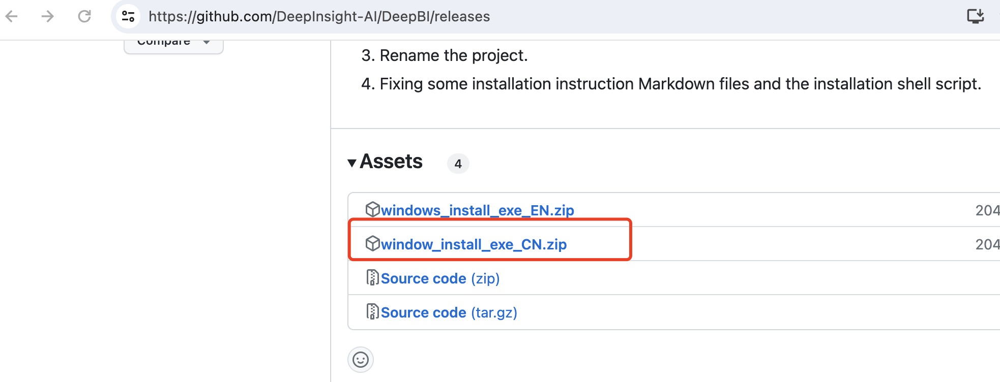
2. 解压安装
 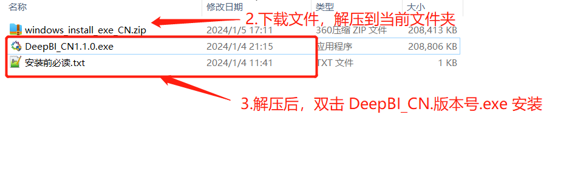
3. 选中桌面快捷方式
 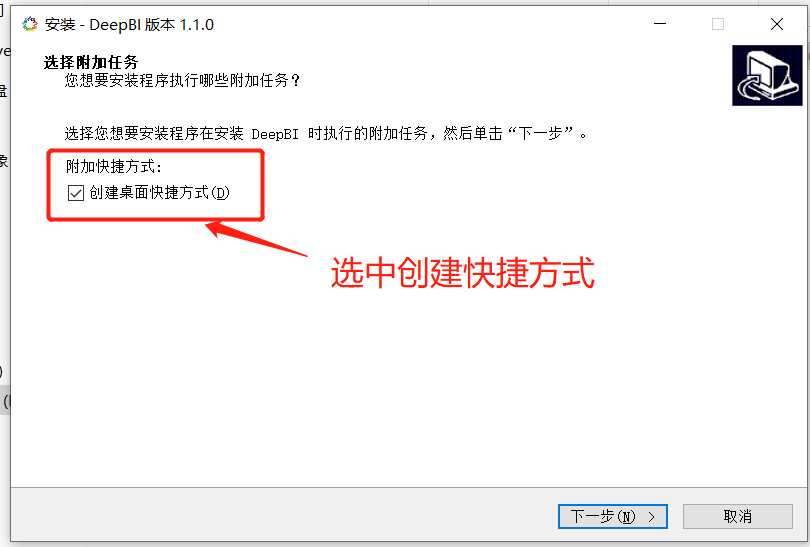
4. 点击，安装，开始解压文件
 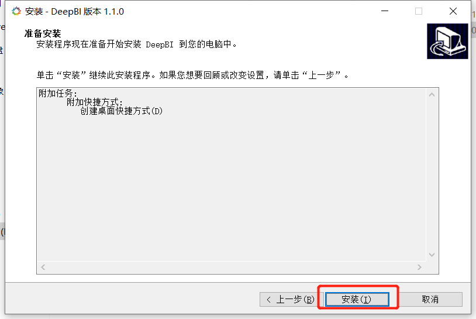
5. 解压完毕，显示软件信息说明
 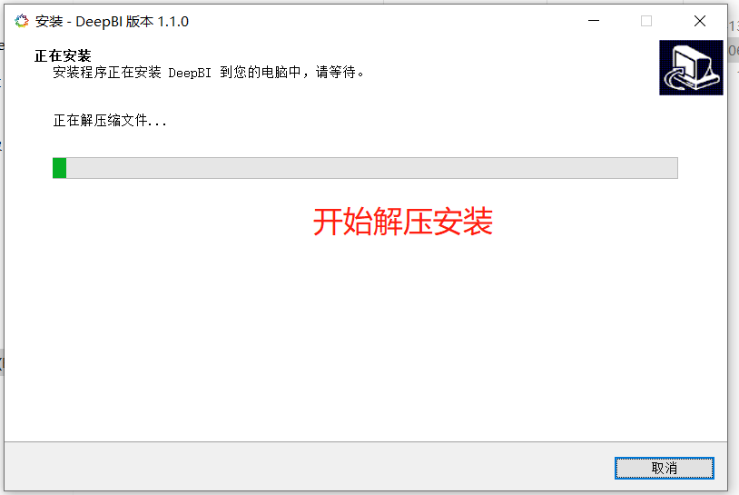
 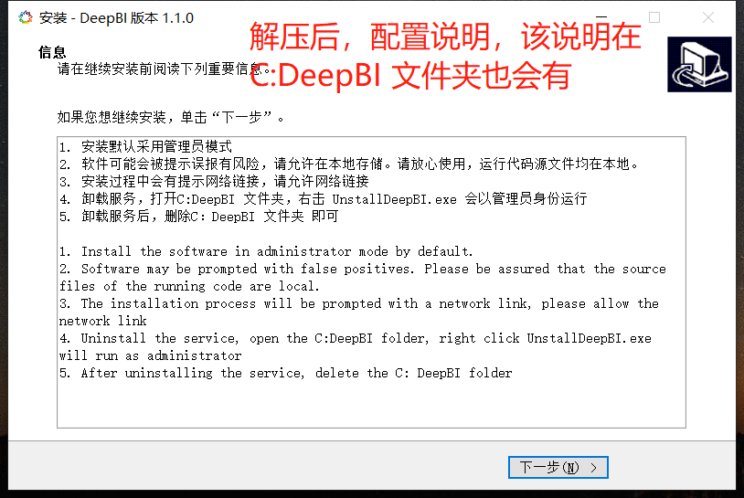
6. 确认后，选中 运行DeepBI，点击完成
 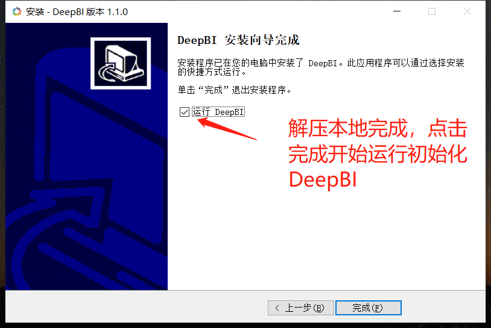
7. 等待数据初始化
 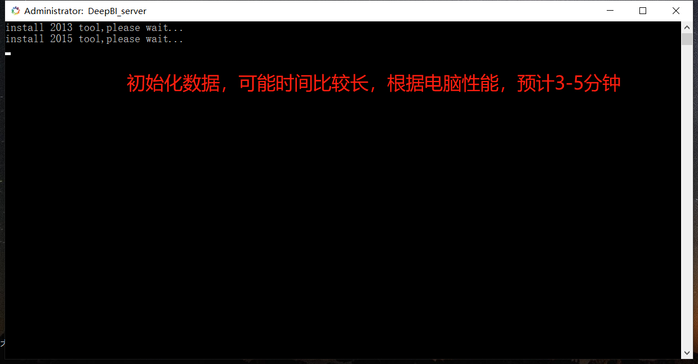
8. 初始化完毕，自动打开网页
 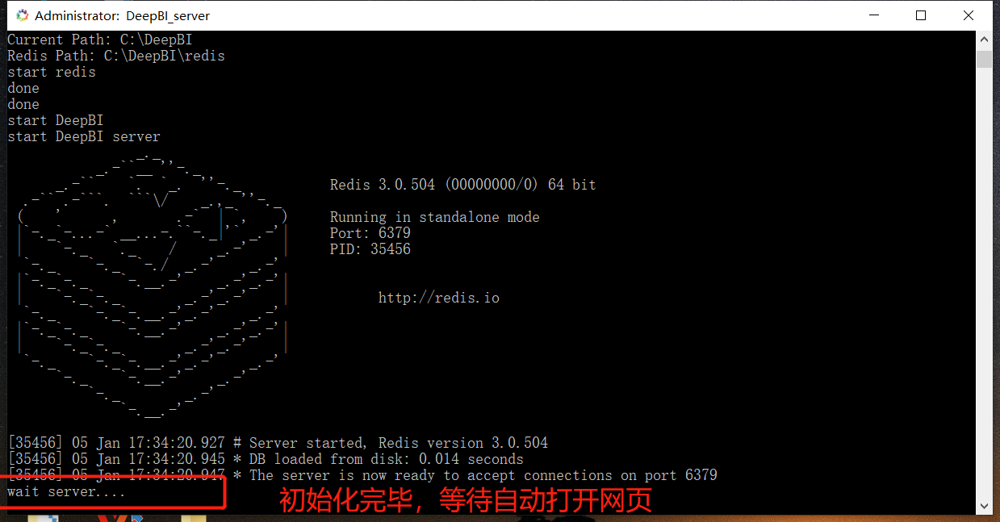
9. 安装成功页面显示，以及成功启动提示
 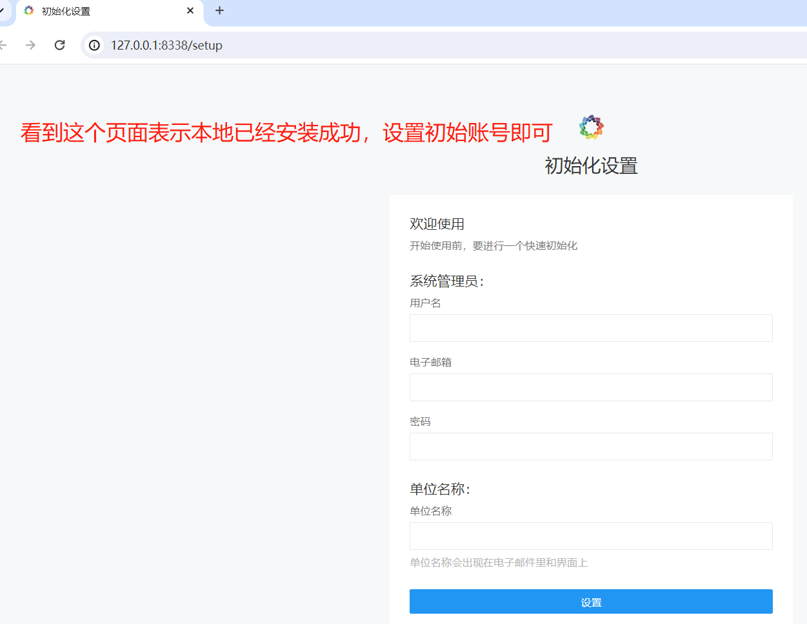
10. 关闭服务
 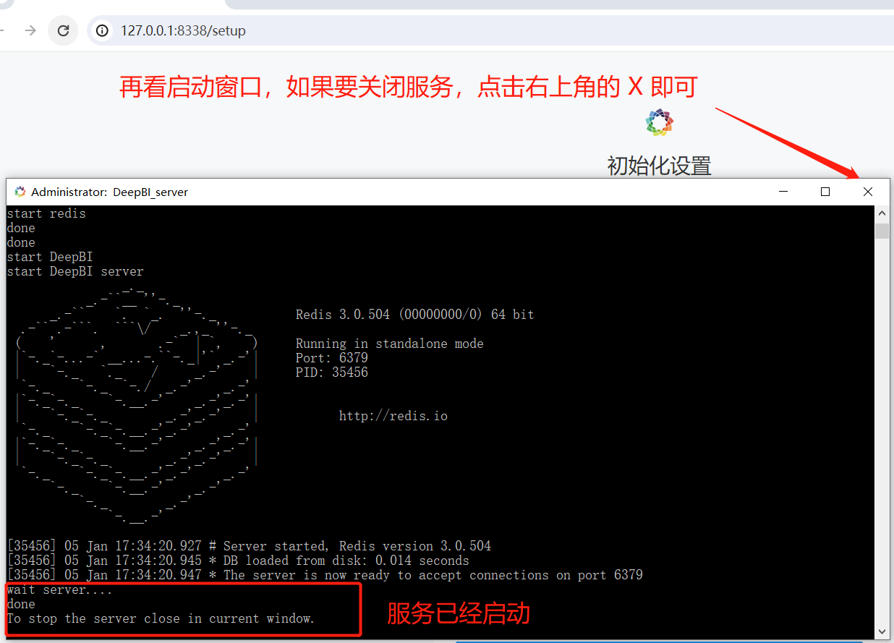
11. 重新启动服务
 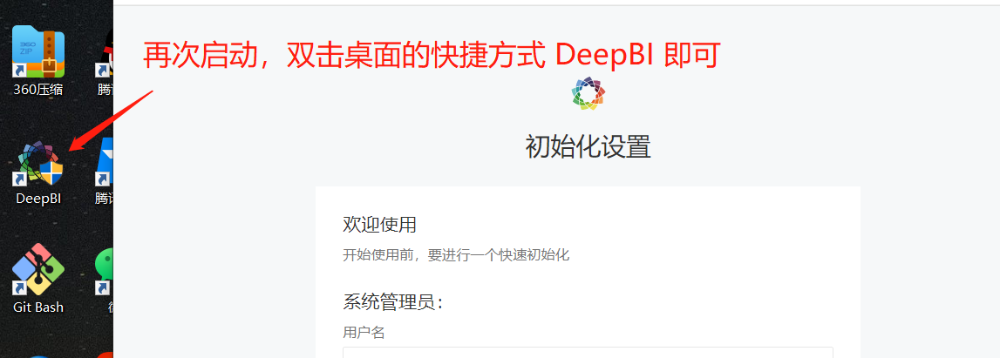

- 以上就是 DeepBI安装过程，使用说明，请点击 [DeepBI 在线使用说明](client/app/assets/images/cn/user_manual_cn.md)

## Exe安装遇到问题解决方案

1. 安装过程提示没有权限 见下图：：
 
- Appear：
```
The files belonging to this database system will be owned by user "00767127".
This user must also own the server process. The database cluster will be initialized with locale "Chinese (Simplified)_China.936".
 initdb: could not find suitable text search configuration for locale "Chinese (Simplified)_China.936"
  The default text search configuration will be set to "simple".
 Data page checksums are disabled. fixing permissions on existing directory C:/DeepBI/pgsqldata ...
 initdb: error: could not change permissions of directory "C:/DeepBI/pgsqldata": Permission denied pg_ctl: directory "C:/DeepBI/pgsqldata" is not a database
 cluster directory createdb: error: connection to server at "localhost" (::1), port 5432 failed: Connection refused (0x0000274D/10061) Is the server running on that host and accepting TCP/IP connections?
```
- solution：

（1）（1）停止服务，打开命令行，以管理员身份打开,点击window 窗口，直接输入cmd 如下图:

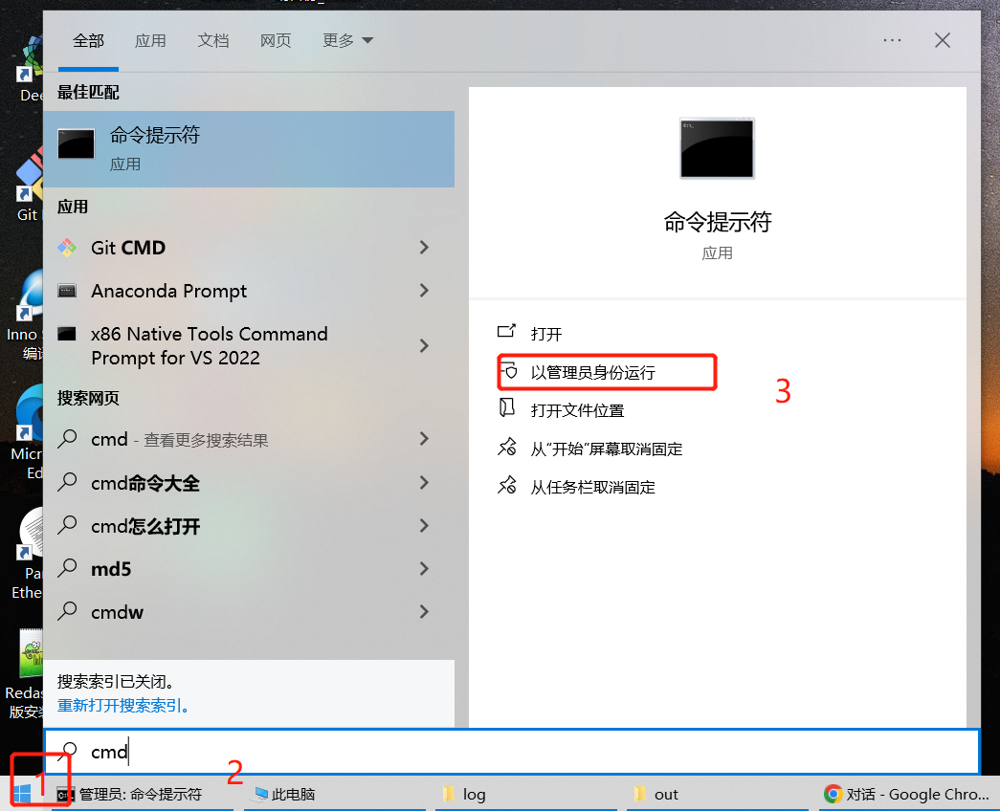

（2）上面命令命令一般再C:\WINDOWS\system32,转到C:DeepBI 文件夹下，运行 stop.bat

 运行: ``` cd ../../DeepBI```
 运行: ```stop.bat``` ,等待运行完毕

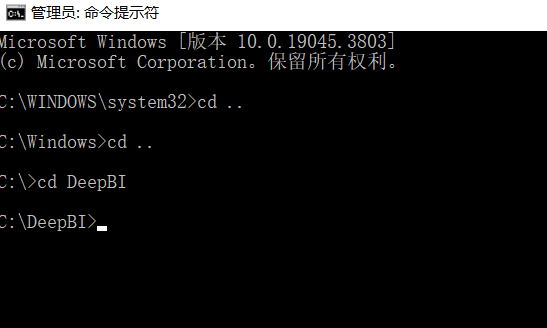

 （3）删除历史无权限文件

  打开 C:\DeepBI 然后删除 .init文件 和 pgsqldata 文件夹

 （4）给文件夹权限

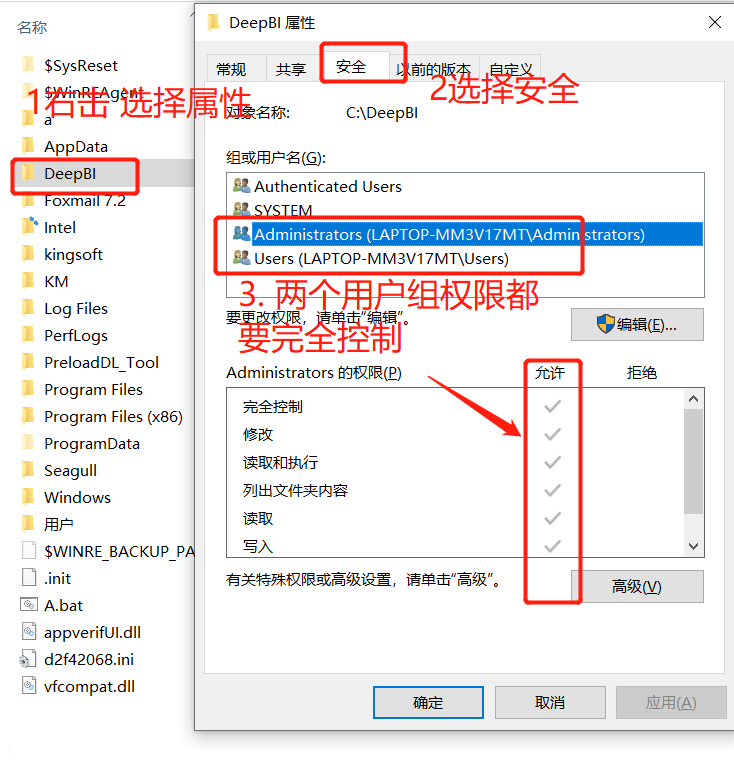

 （5）重新打开管理员命令行，到DeepBI下 命令行运行start.bat 等待启动即可

2. 安装完毕设置网页账号登录后一直处于加载中。


 右击页面，选择检查，选择


如果出现js无法加载

解决方法：

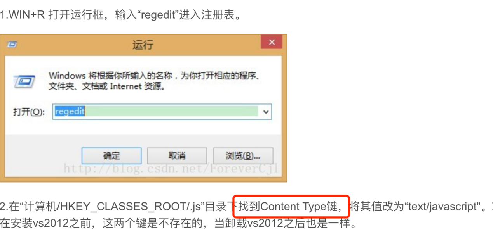

