# DeepBI windows exe Local installation instructions

1. Software download, click here to download!
 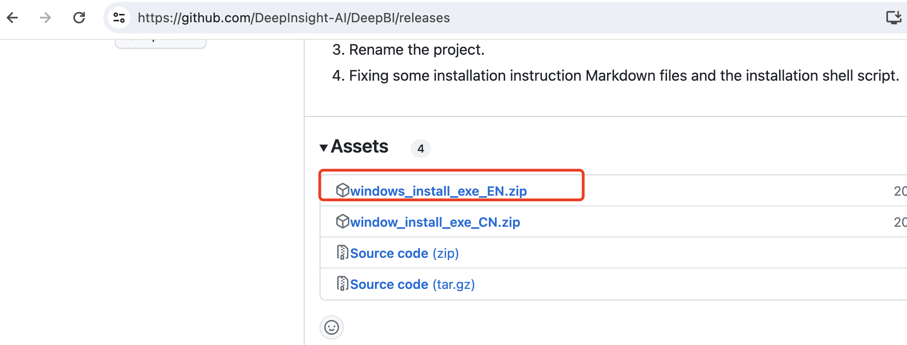
2. Unzip the installation
 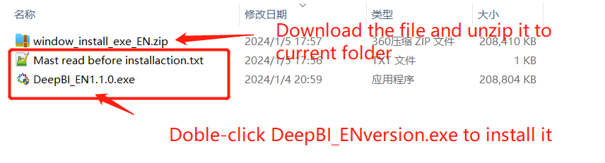
3. Check the desktop shortcut
 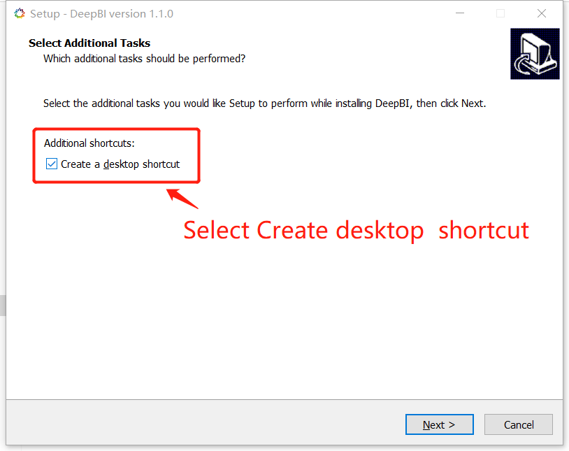
4. Click, Install, and start extracting the files
 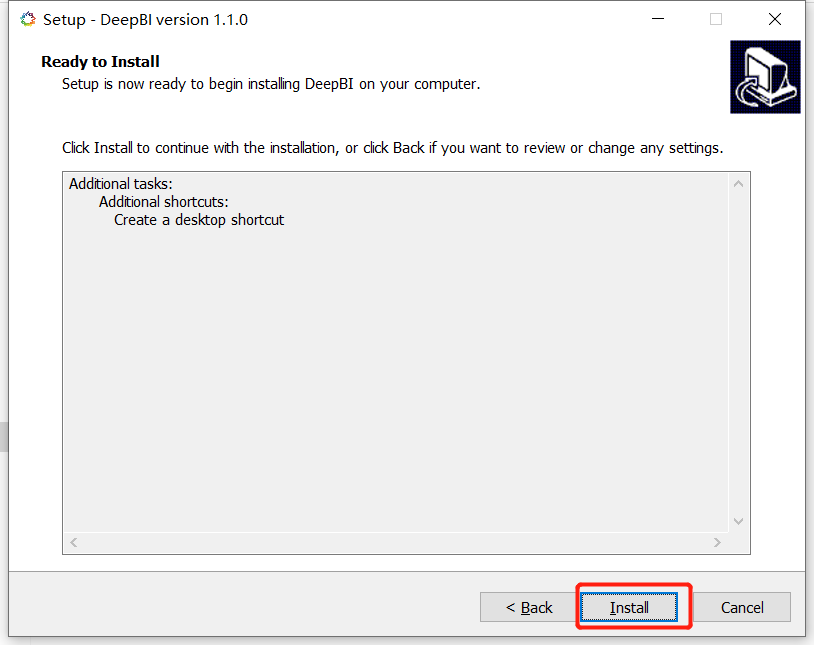
5. Decompression completed, display software information description
 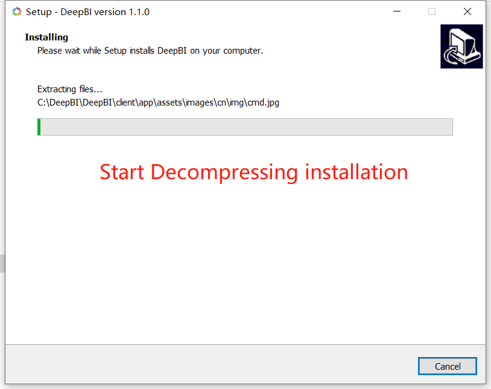
 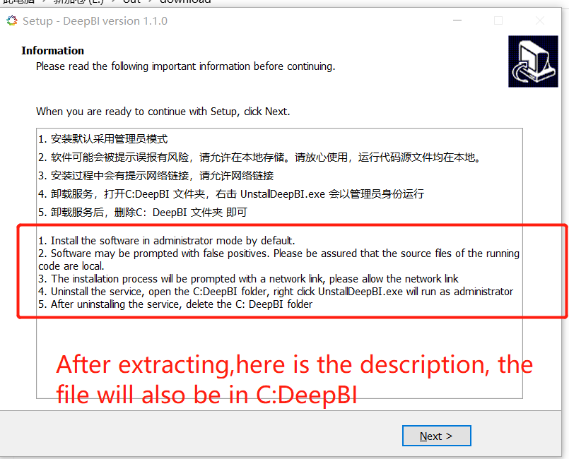
6. Once confirmed, select Run DeepBI and click Finish
 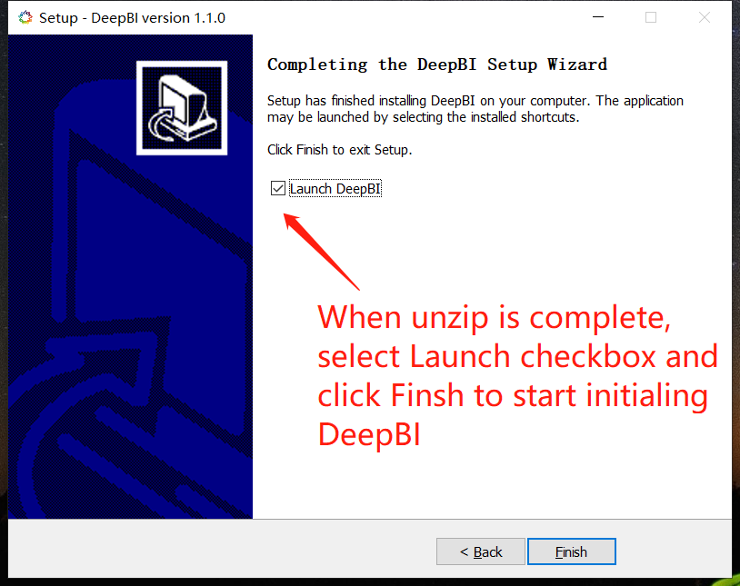
7. Wait for data initialization
 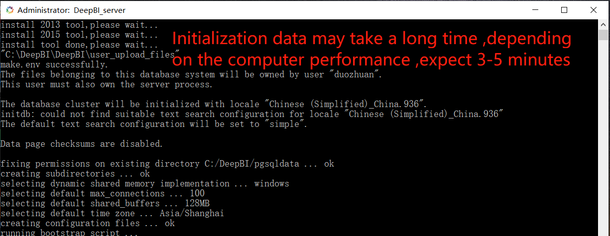
8. After initialization, the page opens automatically
 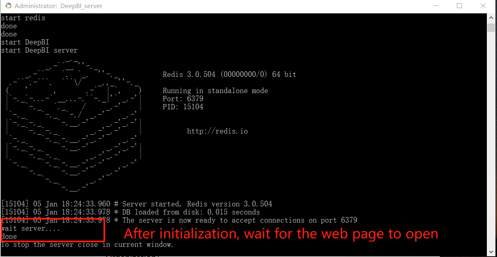
9. The installation success page displays, as well as the successful startup prompt
 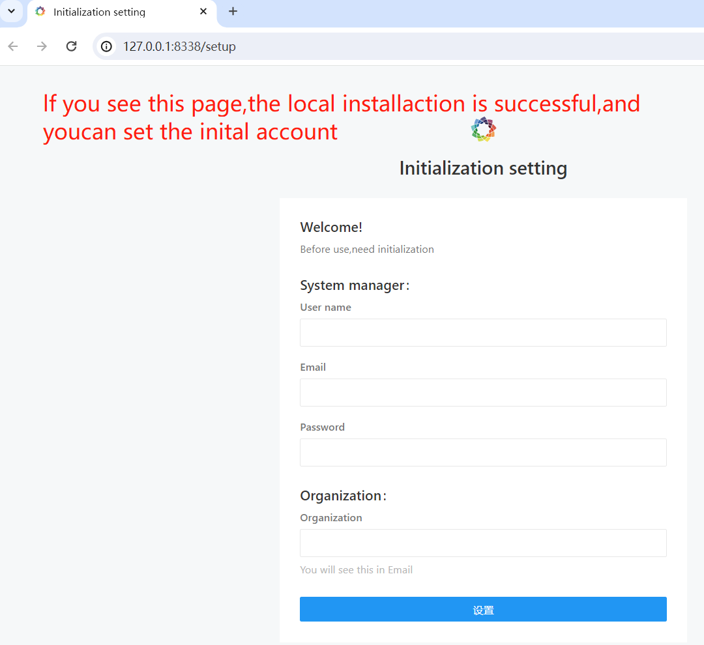
10. close.
 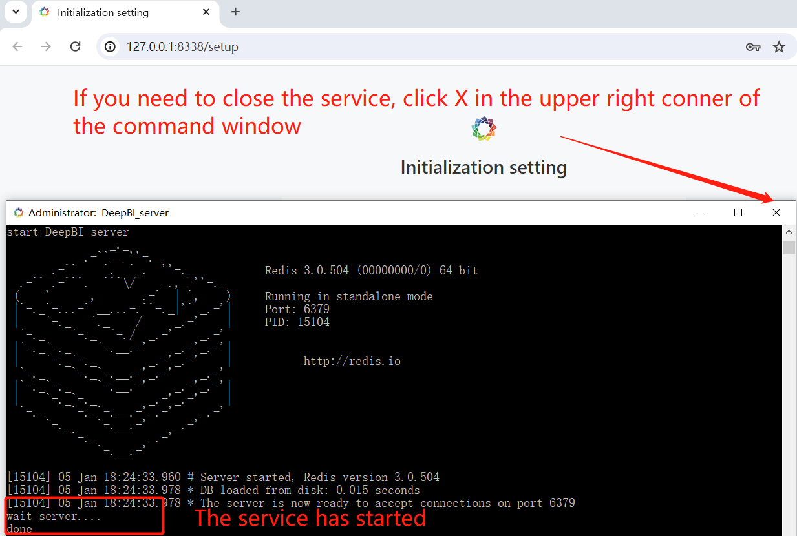
11. Restart service
 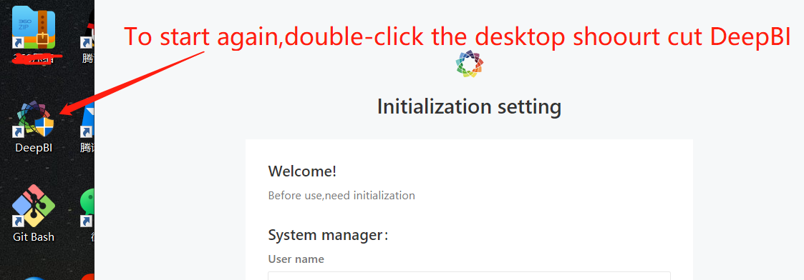
- Above is DeepBI installation process, use instructions, [DeepBI user manual](client/app/assets/images/en/user_manual_en.md)

## An error occurred during installation and the solution

1. Promblem: A message indicating no permission is displayed during installation, as fellows：
 
- Appear：
```
The files belonging to this database system will be owned by user "00767127".
This user must also own the server process. The database cluster will be initialized with locale "Chinese (Simplified)_China.936".
 initdb: could not find suitable text search configuration for locale "Chinese (Simplified)_China.936"
  The default text search configuration will be set to "simple".
 Data page checksums are disabled. fixing permissions on existing directory C:/DeepBI/pgsqldata ...
 initdb: error: could not change permissions of directory "C:/DeepBI/pgsqldata": Permission denied pg_ctl: directory "C:/DeepBI/pgsqldata" is not a database
 cluster directory createdb: error: connection to server at "localhost" (::1), port 5432 failed: Connection refused (0x0000274D/10061) Is the server running on that host and accepting TCP/IP connections?
```
- solution：

（1）Stop the service and open the command line as an administrator
  Click the Window window and enter cmd as shown below:

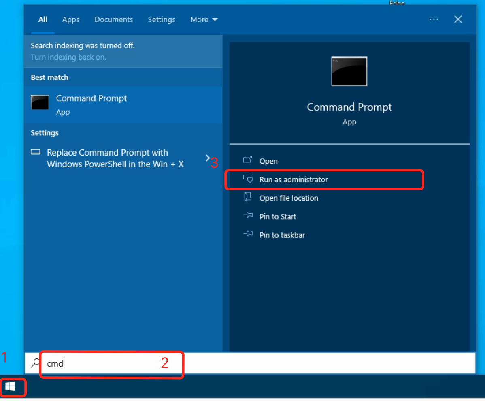

（2）The command after the above command is generally in the directory 	C:\WINDOWS\system32,Go to the C:DeepBI folder and run stop.bat
 run command: ``` cd ../../DeepBI```
 run command: ```stop.bat``` ,then wait for the run to finish

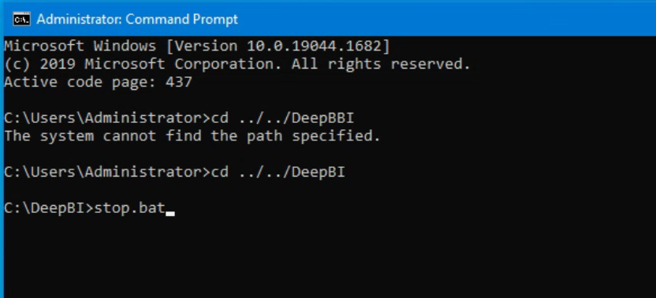

 （3） Delete historical files without permission
    Open folder C:\DeepBI and delete the “.init” file and the “pgsqldata” folder

 （4）Give folder permission

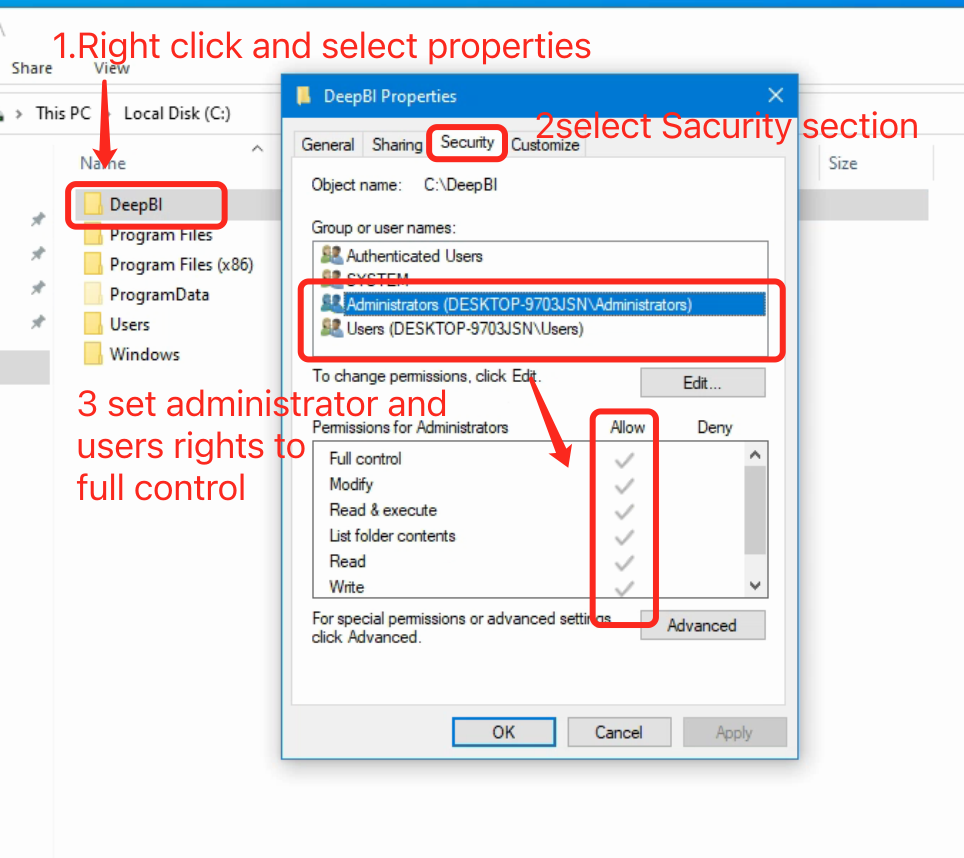

 （5）Reopen the administrator command line cmd and go to C:\DeepBI
Run start.bat on the CLI and wait until the command is complete

2. Promblem: After the installation is complete, the web account is keeping loading after login.

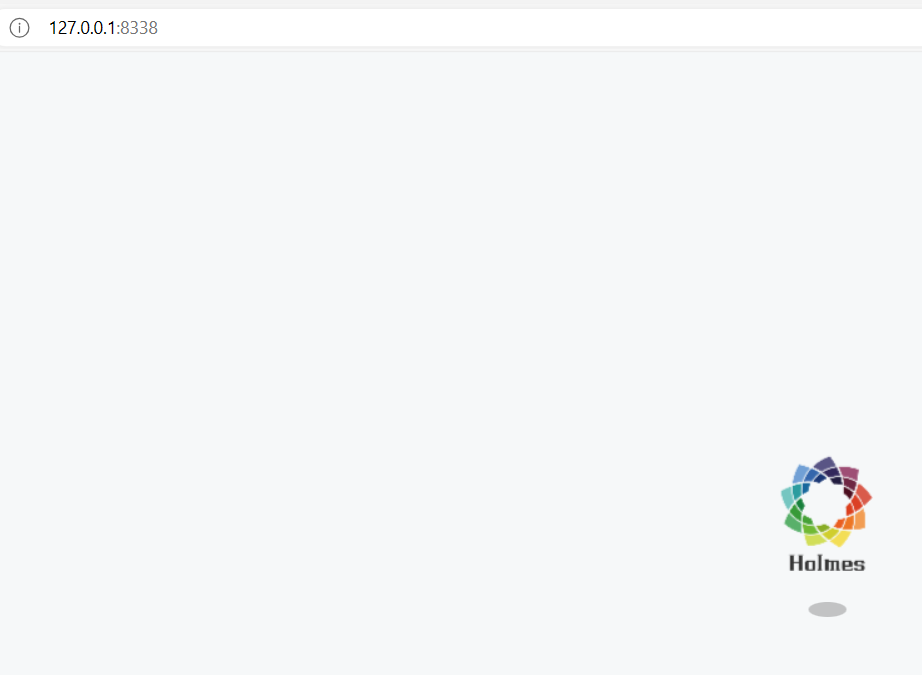

 Right-click the page, select Check, and select Console


If the js files can not load

Solution：

（1）WIN+R Open the CMD command box and enter "regedit" to enter the registry

（2）In the "Computer /HKEY_CLASSES_ROOT/.js" directory, locate the Content Type key and change its value "text/plain" to "text/javascript"

