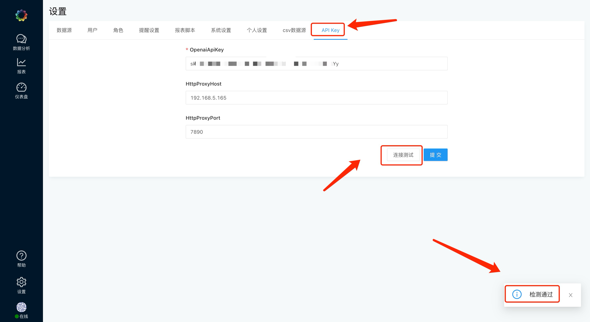
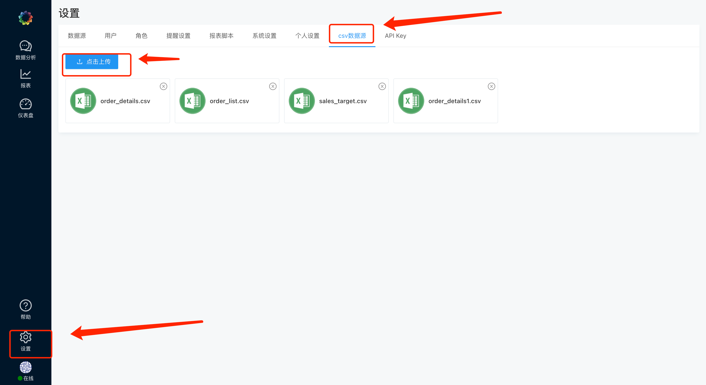
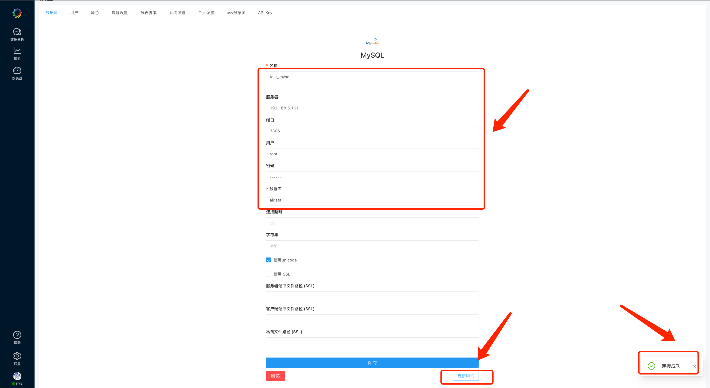
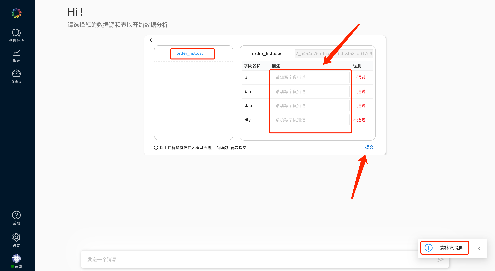
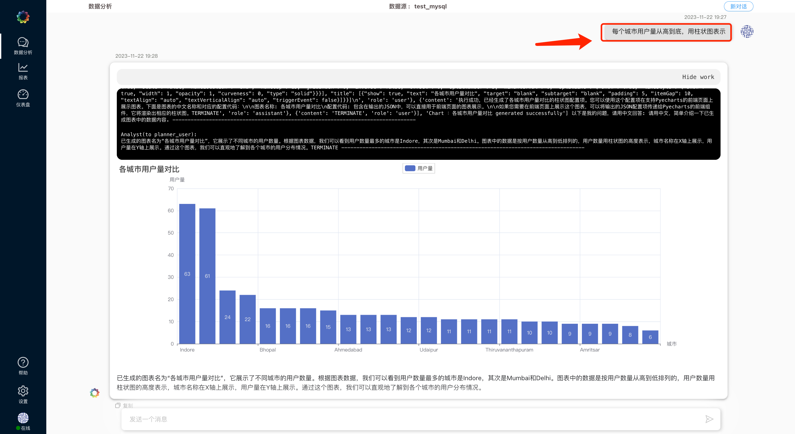
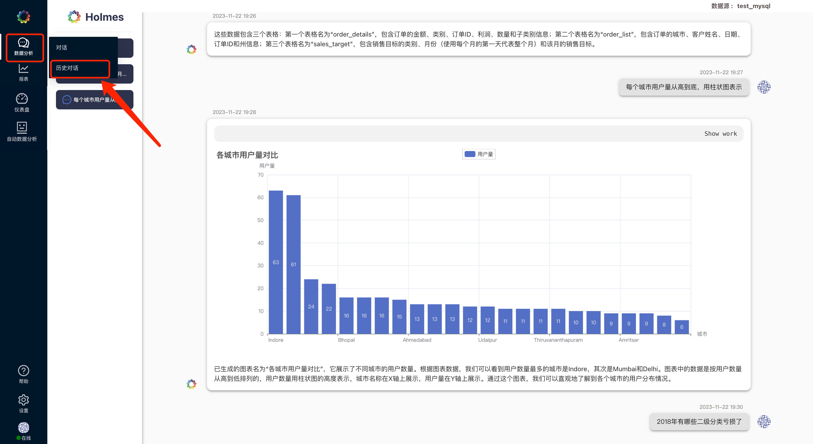
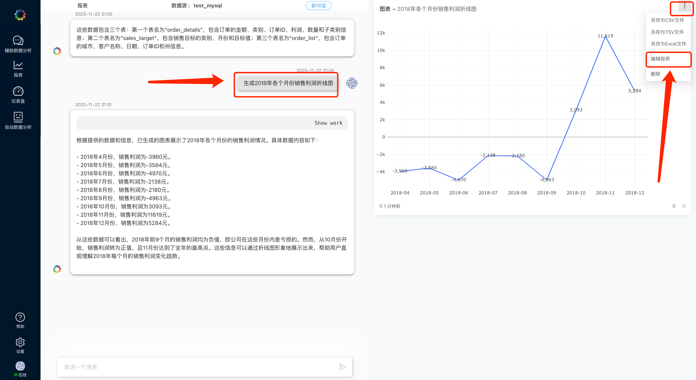
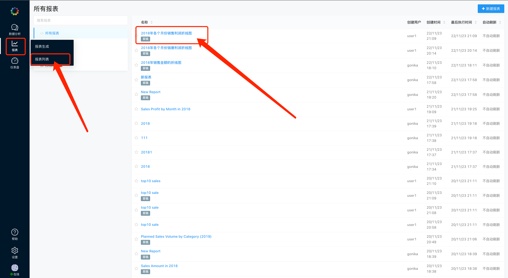
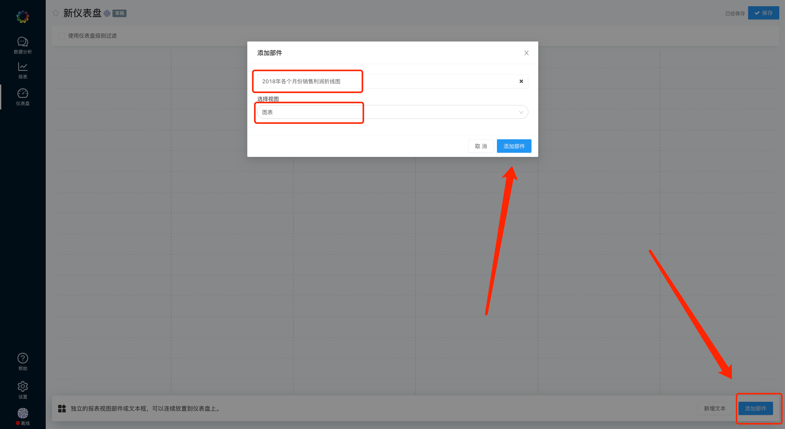

<h1 align="center">DeepBI 使用说明</h1>

Languages：中文  [English](../en/user_manual_en.md)

<h2 align="left">1，配置 API KEY</h2>

- [设置]-[API KEY]

### 1.1, 关于 OPENAI API KEY:

- API KEY 需要 OPENAI GPT4 模型的访问权限
- 后续会陆续支持其他大模型，敬请期待

### 1.2, 关于 代理:

- OPENAI API 访问可能需要科学上网,请小伙伴们自行配置代理

- KEY和代理配置完毕后，配置完毕后，点击【连接测试】，显示 测试通过 即可。
测试不通过的情况，请自行检查 API KEY是否可用，以及代理是否配置正确。

<h2 align="left">2, 配置 数据源</h2>

- 目前支持的数据源有， MySql，Doris, starRocks, PostgreSql, 和 CSV
- 后续会陆续支持更多数据源，如sqlserver，clickhouse，SQLite等，敬请期待

### 2.1, CSV数据源配置:

- 【设置】-【CSV数据源】-【点击上传】- 选择需上传的csv文件即可

### 2.2, [MySql，Doris, starRocks, PostgreSql] 数据源配置:

- 【设置】-【数据源】-【新建一个数据源】
- 选择数据源，填写数据库信息，并保存
- 配置完毕后，点击【连接测试】，显示 连接成功 即可

<h2 align="left">3, 数据分析</h2>

<h3 align="left">3.1, [数据分析] - [对话]</h3>

#### 3.1.1. 勾选数据（数据源和表）

- 勾选的数据会作为对话数据分析中AI的基础数据

#### 3.1.2, 填写注释，提交AI检测

- 尽量完善表格和字段注释，协助AI更好的理解这些数据，使Agent更好的完成数据分析任务

#### 3.1.3, 修改未通过的注释，再次提交

- AI会反馈未通过的注释，请修改补充后，再次提交，直到所有注释通过检测

#### 3.1.4, 所有注释检测通过后，开始对话

- 🔥 注: 若要生成持久化报表，请使用【报表】-【报表生成】，数据分析中出现的报表均为临时报表，不支持持久化

#### 3.1.5, 重选数据源

- 若要重选数据源，进行新一轮对话，请点击【新对话】，重置当前对话，当前对话记录会存储进【历史对话】中

<h3 align="left">3.2, 【数据分析】-【历史对话】</h3>
- 可查看历史对话记录

<h2 align="left">4, 报表 </h2>

<h3 align="left">4.1,【报表】-【报表生成】</h3>

#### 4.1.1. Check the data (data source and table)

- 勾选的数据会作为报表生成中AI的基础数据
- 🔥注: 目前CSV数据源不支持【报表生成】

#### 4.1.2, 填写注释，提交AI检测

- 尽量完善表格和字段注释，协助AI更好的理解这些数据，使Agent更好的完成报表生成任务

#### 4.1.3, 修改未通过的注释，再次提交

- AI会反馈未通过的注释，请修改补充后，再次提交, 直到所有注释检测通过

#### 4.1.4, 所有注释检测通过后，开始对话生成报表

- 点击【编辑报表】，可直接编辑 新生成的报表.
- 🔥 注: 【报表生成】模块目前仅支持持久化报表生成任务，分析类问题，请使用【数据分析】-【对话】

#### 4.1.5, 重选数据源 

- 若要重选数据源，进行新一轮对话，请点击【新对话】，重置当前对话

<h3 align="left">4.2, 【报表】-【报表列表】</h3>

#### 4.2.1, 报表状态

- 【报表生成】中新生成的报表会出现在【报表列表】中，此时报表为 草稿 状态，若想要在【仪表盘】展示该报表，请点击 【发布】 按钮，将报表状态变更为 已发布 状态

#### 4.2.2, 修改SQL语句

- 点击【编辑源】，可自定义修改报表的SQL语句.

#### 4.2.3, 修改图表样式

- 点击【编辑可视化】，可自定义编辑 可视化图表样式
- 点击【新增可视化】，可增加可视化图表

#### 4.2.4, 删除报表

- 点击【归档】，可将报表状态变更为 归档（删除）状态

<h3 align="left">5, 仪表盘</h3>

<h4 align="left">5.1, 新建仪表盘</h4>

- 【仪表盘】-【新建】- 编辑仪表盘

- 将刚生成的【已发布 】报表，添加进仪表盘

- 点击【发布】仪表盘

<h4 align="left">5.2 分享仪表盘 </h4>

- 点击【发布】后，即可分享仪表盘

