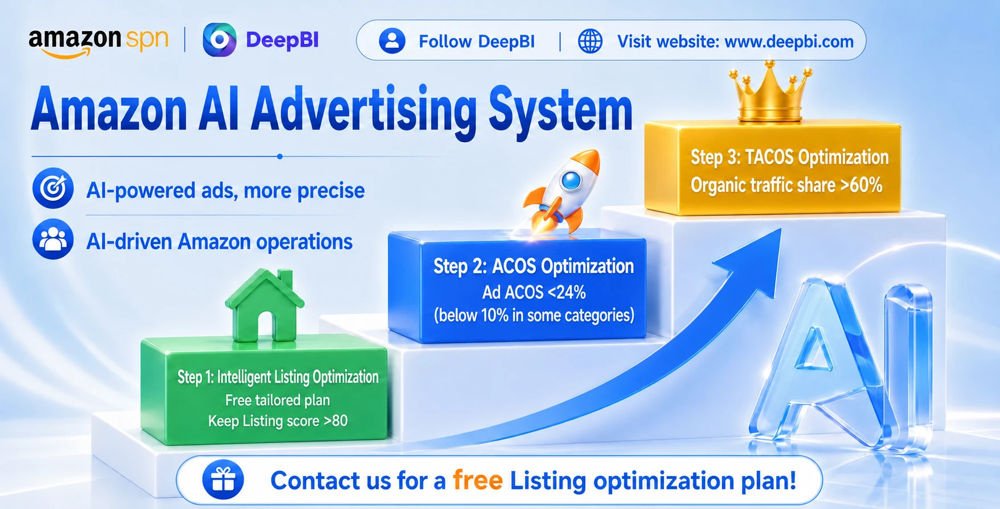
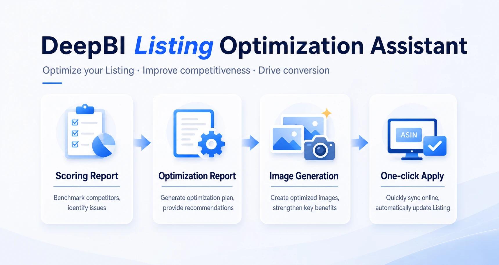
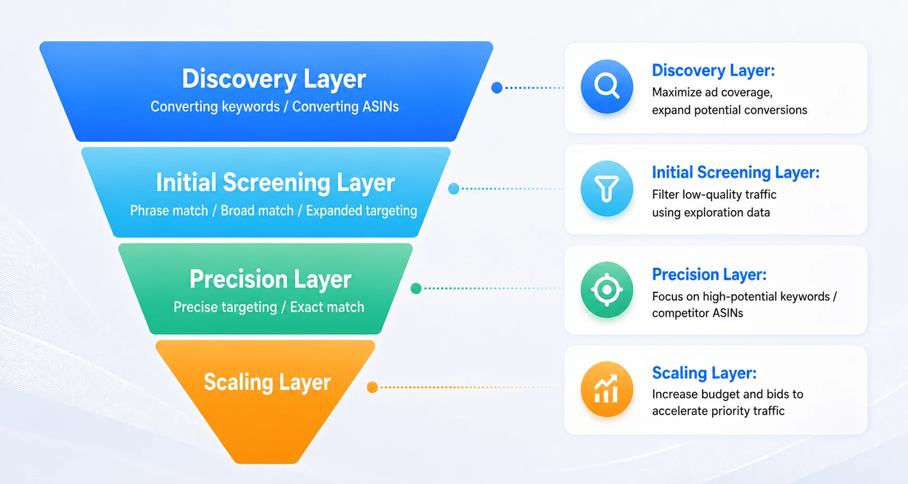
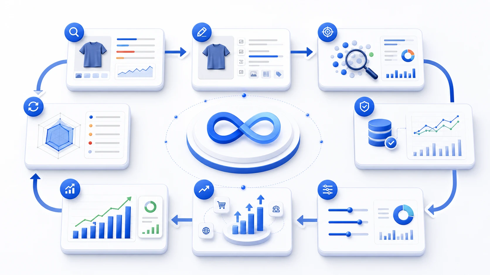

<h1 align="center">DeepBI - Amazon AI Advertising Assistant</h1>

<p align="center"><a href="readme_zh.md">简体中文</a> · <b>English</b></p>

<p align="center">
  <strong>Turn Amazon advertising from manual bid tuning into an AI operating system that continuously explores, validates, and scales valuable traffic.</strong>
</p>

<p align="center">Listing optimization · AI advertising optimization · Organic growth</p>

<p align="center">
  <a href="https://www.deepbi.com">Website</a> ·
  <a href="mailto:support@deepbi.com">Support: support@deepbi.com</a> ·
  <a href="https://github.com/DeepInsight-AI">GitHub</a>
</p>

<p align="center">
  
</p>

DeepBI connects **listing conversion, paid acquisition, and organic growth** into one continuously improving AI operating loop. It does not only ask whether ACOS should go down; it helps teams decide where the next budget dollar and optimization action are most valuable.

---

## Contents

- [What is DeepBI?](#what-is-deepbi)
  - [Step 1: Listing optimization](#step-1-listing-optimization)
  - [Step 2: AI advertising optimization](#step-2-ai-advertising-optimization)
  - [Step 3: Organic traffic and TACOS optimization](#step-3-organic-traffic-and-tacos-optimization)
- [Why use AI to manage Amazon advertising?](#why-use-ai-to-manage-amazon-advertising)
- [How does the AI advertising system work?](#how-does-the-ai-advertising-system-work)
- [Advanced operating guide](docs/operating-playbook.md)
- [Listing and advertising must be viewed together](docs/operating-playbook.md#listing-和广告必须一起看)
- [DeepBI's operating loop](#deepbis-operating-loop)
- [Who is DeepBI for?](#who-is-deepbi-for)
- [Project](docs/project.md)
- [Contact](#contact)

---

## What is DeepBI?

DeepBI is an AI operating system for Amazon sellers. We look beyond lowering advertising ACOS and focus on the complete path from listing readiness, to paid acquisition, to organic growth.

### Step 1: Listing optimization

First, answer a basic question: **when advertising brings a shopper in, can the listing convert them?**

DeepBI analyzes titles, main images, bullet points, A+ content, detail pages, reviews, and benchmark competitors to identify the problems that affect conversion.

<p align="center"></p>

### Step 2: AI advertising optimization

Once the listing can convert traffic, the next question is: **where should the next advertising dollar go?**

DeepBI continuously explores keywords, search terms, competitor ASINs, and product traffic entry points. It validates opportunities with real clicks, conversions, sales, ACOS, stability, SKU performance, and time-based changes.

<p align="center"></p>

### Step 3: Organic traffic and TACOS optimization

The long-term goal of advertising is not only more ad-attributed orders. Healthy growth also means more sales history, stronger keyword performance, better organic rankings, a higher organic share, and improving TACOS.

> DeepBI asks whether advertising is moving the product toward a healthier organic growth state.

---

## Why use AI to manage Amazon advertising?

Amazon advertising changes every day: search demand, CPC, competitor prices and inventory, conversion rates, SKU inventory, seasonal demand, and keyword quality all move.

The hard part of manual operations is not knowing how to change one bid. It is continuously deciding what deserves attention across thousands of keywords, competitor ASINs, SKUs, budgets, and campaigns.

DeepBI is designed to keep making that decision with fresh data.

---

## How does the AI advertising system work?

1. **Explore new traffic.** Expand beyond a fixed keyword list and discover new search terms, competitor ASINs, and product entry points.
2. **Use AUTO and competitor ASINs.** AUTO broadens the search boundary; competitor ASIN targeting finds detail-page opportunities that are realistically competitive.
3. **Validate instead of making one-time judgments.** A single order does not automatically make a keyword or ASIN valuable. DeepBI keeps observing clicks, conversions, sales, ACOS, stability, SKU performance, and time trends.
4. **Adjust bids dynamically.** A low CPC is not inherently good. The key question is whether the traffic purchased at that price creates operating value.
5. **Adjust budgets dynamically.** Stable, efficient, high-contribution traffic earns more budget; traffic with rising spend and weakening conversion gradually contracts.

---

## Advanced operating guide

Different product stages need different decisions: new products need enough learning data, stable products must balance efficiency with scale, and inventory or margin pressure calls for tighter control.

Read the complete framework for **Target ACOS, multi-variation SKUs, new product launches, and seasonal traffic** in the [DeepBI Amazon Advertising Operating Guide](docs/operating-playbook.md).

---

## DeepBI's operating loop

<p align="center"></p>

```text
Diagnose listing competitiveness
          ↓
Improve conversion readiness
          ↓
Explore new advertising traffic
          ↓
Filter keywords, search terms, and competitor ASINs
          ↓
Validate traffic value
          ↓
Adjust bids and budgets
          ↓
Scale effective traffic
          ↓
Grow advertising sales and organic ranking
          ↓
Improve TACOS
          ↓
Start the next optimization cycle
```

DeepBI is not a fixed SOP. It is a decision loop that re-evaluates the next best action as new data arrives.

---

## Who is DeepBI for?

- Sellers with high ad spend but unstable ACOS who need to distinguish traffic, bids, listings, SKUs, and product competitiveness.
- Businesses managing many ASINs, SKUs, campaigns, search terms, budgets, and bids.
- New products that need to discover and validate valuable traffic quickly.
- Seasonal products and major promotion periods where opportunities appear and fade quickly.
- Teams moving beyond ad optimization toward listing conversion, organic traffic, TACOS, and overall profit efficiency.

---

## About DeepBI

DeepBI focuses on AI operations and growth for Amazon sellers. The goal is not to replace every business decision, but to let AI handle continuous monitoring, traffic exploration, and advertising optimization so sellers can focus on products, supply chain, and higher-value decisions.

See the [project overview](docs/project.md) for background and future directions. If this approach is useful, please ⭐ Star the project.
