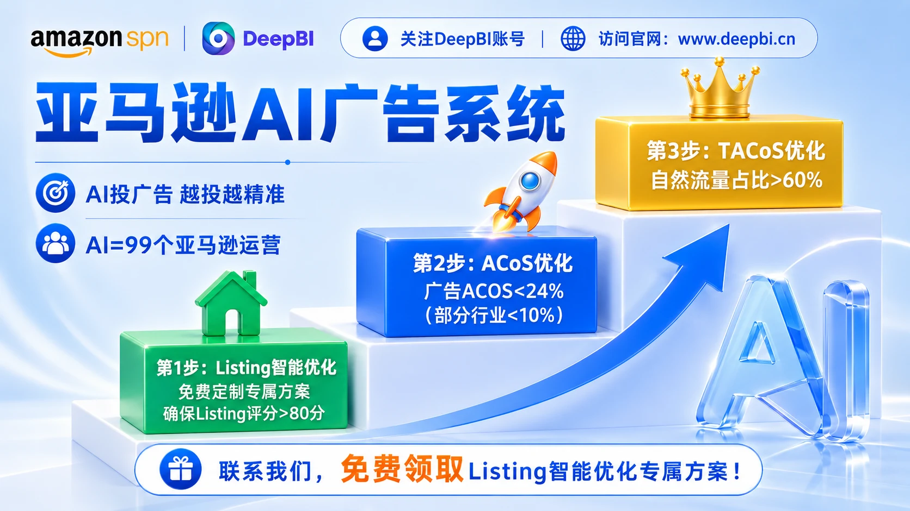
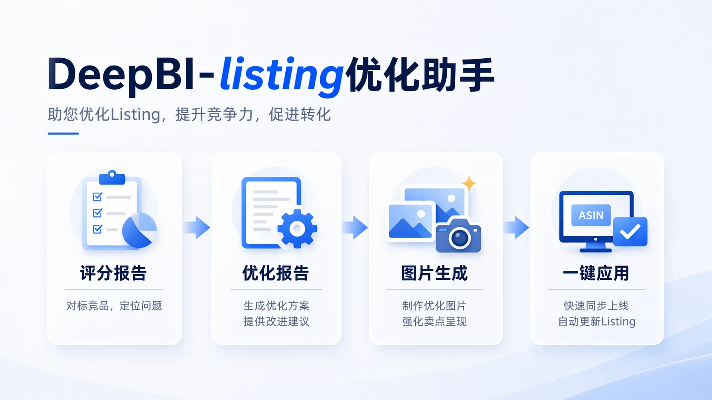
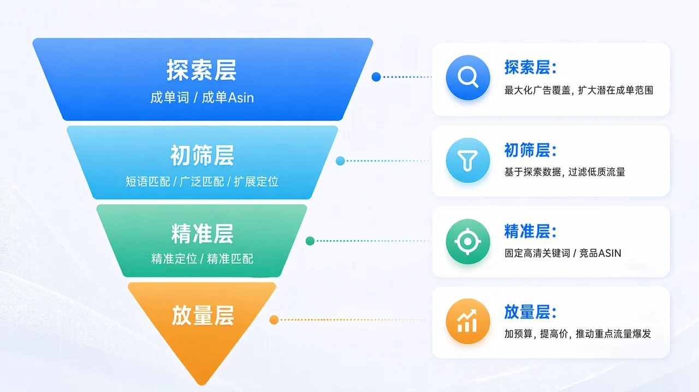

<h1 align="center">DeepBI - Amazon智能AI广告助手</h1>

<p align="center"><b>简体中文</b> · <a href="readme_en.md">English</a></p>

<p align="center">
  <strong>让 Amazon 广告从“人工调参数”，变成持续探索、验证和放大有效流量的 AI 运营系统。</strong>
</p>

<p align="center">
  Listing 优化 · AI 广告优化 · 自然流量增长
</p>

<p align="center">
  <a href="https://www.deepbi.cn">官网</a> ·
  <a href="mailto:dev@deepbi.com">联系邮箱：dev@deepbi.com</a> ·
  <a href="https://github.com/DeepInsight-AI">GitHub</a>
</p>

<p align="center">
  
</p>

DeepBI 面向 Amazon 卖家，将 **Listing 承接、广告获客与自然流量增长** 连接为一个持续运行的 AI 运营闭环。它不只回答“广告该不该降 ACOS”，更帮助团队持续判断：下一笔预算、下一个优化动作，最值得投入在哪里。


##  联系方式
<p align="center"><sub>扫码添加 DeepBI 企业微信</sub></p>
<p align="center">
  
</p>


---

## 内容导航

- [DeepBI 是什么？](#deepbi-是什么)
  - [Step 1：Listing 智能优化](#step-1listing-智能优化)
  - [Step 2：AI 广告优化](#step-2ai-广告优化)
  - [Step 3：自然流量与 TACOS 优化](#step-3自然流量与-tacos-优化)
- [为什么需要 AI 来管理 Amazon 广告？](#为什么需要-ai-来管理-amazon-广告)
- [DeepBI AI 广告系统如何工作？](#deepbi-ai-广告系统如何工作)
  - [持续探索新的流量](#1-持续探索新的流量)
  - [AUTO + 竞品 ASIN 探索](#2-auto--竞品-asin-探索)
  - [数据验证，而不是一次判断](#3-数据验证而不是一次判断)
  - [动态调整竞价](#4-动态调整竞价)
  - [动态调整预算](#5-动态调整预算)
- [进阶经营指南](#进阶经营指南)
- [Listing 和广告必须一起看](docs/operating-playbook.md#listing-和广告必须一起看)
- [DeepBI 的核心经营闭环](#deepbi-的核心经营闭环)
- [DeepBI 适合哪些 Amazon 卖家？](#deepbi-适合哪些-amazon-卖家)
- [进阶经营指南](docs/operating-playbook.md)
- [关于项目](docs/project.md)
- [联系方式](#联系方式)

---

##  DeepBI 是什么？

DeepBI 是面向 Amazon 卖家的 AI 运营系统。

我们关注的不只是“把广告 ACOS 降下来”，而是一个商品从 Listing 承接、广告获客，到自然流量增长的完整经营过程。

DeepBI 将这一过程拆成三个阶段：

###  Step 1：Listing 智能优化

先解决一个基础问题：

> 广告把买家带进来了，Listing 能不能接住？

DeepBI 会从标题、主图、五点、A+ / 详情页、评价等维度分析 Listing，并与标杆竞品进行对照，帮助卖家识别影响转化的关键问题。

目标不是单纯“改文案”，而是找到：

* 买家最先关心什么；
* 当前页面在哪一步失去说服力；
* 哪些内容应该优先调整；
* Listing 与标杆竞品之间真正的差距在哪里。

<p align="center">
  
</p>

---

###  Step 2：AI 广告优化

Listing 能够承接流量之后，再解决：

> 下一笔广告预算，应该花在哪里？

DeepBI AI 广告系统会持续探索 Amazon 上新的流量机会，并通过真实广告数据不断验证。

系统关注的不只是 CPC 或单个关键词，而是：

* 哪些关键词值得继续投；
* 哪些搜索词开始产生订单；
* 哪些竞品 ASIN 存在截流机会；
* 哪些 SKU 当前更适合获得广告资源；
* 哪些流量正在失去价值；
* 当前竞价和预算是否匹配经营目标。

广告不是一次搭建完成。

它是一个持续运行的循环：

```text
探索流量
   ↓
数据验证
   ↓
筛选有效流量
   ↓
减少低效消耗
   ↓
放大高价值流量
   ↓
继续寻找新的机会
```

---

###  Step 3：自然流量与 TACOS 优化

广告的长期目标，不应该只是获得广告订单。

真正健康的增长，是广告帮助商品：

* 积累销量；
* 提升关键词表现；
* 获得更多自然排名；
* 提高自然流量占比；
* 最终改善 TACOS。

所以 DeepBI 并不把 ACOS 当作唯一目标。

我们更关注：

> 广告是否正在推动商品进入更健康的自然增长状态。

---

#  为什么需要 AI 来管理 Amazon 广告？

Amazon 广告不是一套设置好以后长期不动的规则。

每天都在发生变化：

* 搜索需求变化；
* CPC变化；
* 竞品价格变化；
* 竞品库存变化；
* 新竞品出现；
* 商品转化率变化；
* SKU 库存变化；
* 节日和大促带来新的流量；
* 原本有效的关键词开始衰减。

人工运营最大的困难，不是不知道怎么调整一个竞价。

而是：

> **每天面对大量关键词、竞品 ASIN、SKU 和广告数据，很难持续判断下一步最值得做什么。**

DeepBI 试图解决的，就是这个问题。

---

#  DeepBI AI 广告系统如何工作？

<p align="center">
  
</p>

## 1. 持续探索新的流量

**DeepBI** 不会只围绕一批固定关键词长期投放。

系统会持续寻找新的：

* 关键词；
* 搜索词；
* 竞品 ASIN；
* 商品流量入口。

尤其对于新品、季节性商品、大促节点，新的流量机会往往变化很快。

越早发现，越有机会提前完成数据积累。

---

## 2. AUTO + 竞品 ASIN 探索

流量探索中，有两个非常重要的入口。

### AUTO

用于扩大搜索边界，发现卖家原本没有覆盖到的搜索需求。

### 竞品 ASIN

用户在 Amazon 上并不只通过搜索结果完成购买。

当用户正在浏览某个竞品时，如果你的产品同样满足他的核心需求，并且在价格、功能、评价、Listing 或使用场景上具有竞争力，那么这部分商品详情页流量同样具有价值。

DeepBI 会持续寻找：

> **当前真正有机会竞争的竞品 ASIN。**

不是只盯着头部竞品，而是寻找“当前打得过”的流量机会。

---

## 3. 数据验证，而不是一次判断

一个关键词出过一单，并不代表它就是优质关键词。

一个竞品 ASIN 带来过一次订单，也不代表应该立即增加大量预算。

DeepBI 会继续观察：

* 点击；
* 转化；
* 广告销售；
* ACOS；
* 流量稳定性；
* SKU表现；
* 时间变化。

只有经过持续验证的流量，才会获得更多资源。

---

## 4. 动态调整竞价

CPC 不是越低越好，也不是越高越好。

更高的竞价通常可以帮助广告获得更多竞争机会。

但真正需要判断的是：

> **这个价格买到的流量值不值得。**

一个 CPC 较高的关键词，如果能够稳定产生订单，并且 ACOS 在可接受范围内，仍然可能值得继续竞争。

反过来，一个点击非常便宜的关键词，如果长期没有订单，同样没有价值。

DeepBI 根据实际广告结果持续调整竞价，而不是机械追求最低 CPC。

---

## 5. 动态调整预算

预算不是平均分配给所有广告。

已经验证：

* 转化稳定；
* 广告效率健康；
* 销售贡献较高；

的流量，可以获得更多预算。

而长期：

* 花费增长；
* 转化下降；
* 销售贡献不足；

的流量，则需要逐步收缩。

DeepBI 的目标是：

> 让更多预算流向当前真正能够产生经营价值的位置。

---

##  进阶经营指南

不同的商品阶段需要不同的广告决策：新品要先建立足够的学习数据，稳定期要权衡效率与规模，库存或利润变化时则要及时收紧策略。

有关 **Target ACOS、多变体 / 多 SKU、新品推广、节日与季节性流量** 的完整判断框架，请阅读 [DeepBI Amazon 广告经营指南](docs/operating-playbook.md)。

---

#  DeepBI 的核心经营闭环

<p align="center">
  
</p>

```text
Listing 竞争力诊断
        ↓
优化页面承接能力
        ↓
探索新的广告流量
        ↓
筛选关键词 / 搜索词 / 竞品 ASIN
        ↓
验证流量价值
        ↓
动态调整竞价与预算
        ↓
放大有效流量
        ↓
获得更多广告销售
        ↓
推动自然排名与自然流量
        ↓
改善 TACOS
        ↓
根据市场变化重新进入下一轮优化
```

DeepBI 不是执行一套固定 SOP。

它更像一个持续运行的决策循环：

> **根据每天产生的新数据，不断重新判断下一步最值得做什么。**

---

#  DeepBI 适合哪些 Amazon 卖家？

DeepBI 更适合以下场景：

### 广告花费高，但 ACOS 长期不稳定

不知道问题到底来自：

* 关键词；
* CPC；
* 流量；
* Listing；
* SKU；
* 还是产品竞争力。

---

### ASIN / SKU 数量较多

随着商品数量增加，人工每天管理：

* 广告活动；
* 关键词；
* 搜索词；
* 竞品；
* 预算；
* 出价；

成本会快速上升。

---

### 新品需要持续探索流量

新品没有历史数据，需要快速验证：

> 哪些流量真正值得继续投入。

---

### 季节性产品或大促期间

流量变化非常快，需要更及时地：

* 发现机会；
* 放大机会；
* 退出衰退流量。

---

### 希望从“优化广告”走向“改善整体经营效率”

不只关注广告 ACOS。

而是进一步关注：

* Listing转化；
* 广告销售；
* 自然流量；
* TACOS；
* 整体利润效率。

---

#  关于 DeepBI

DeepBI 专注于 Amazon AI 运营与增长。我们的目标不是让 AI 替卖家做所有经营决策，而是让 AI 承担持续的数据监控、流量探索和广告优化工作，让卖家把精力放在产品、供应链和更重要的经营判断上。

更多项目背景与后续内容方向，请查看 [项目说明](docs/project.md)。如果这套方法对你有帮助，欢迎 ⭐ Star 本项目。

